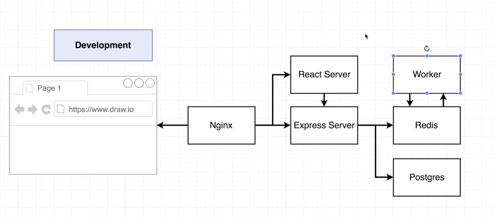

## Dockerized multiple services

React application for getting the fibonacci number for a given index. The application itself is not of value here. The aim is to have mutiple docker services running and ensuring we bring the building time of the 3 containers to a minimum.

## Arthitecture

## Getting started

Bring up Redis, Postgres and our Server with:
> docker-compose up

#### Client
> cd client
> docker build -f Dockerfile.dev .
> docker run <containerId>

#### Server
> cd server
> docker build -f Dockerfile.dev .
> docker run <containerId>

#### Worker
> cd worker
> docker build -f Dockerfile.dev .
> docker run <containerId>

## Source

[Resource](https://www.udemy.com/course/docker-and-kubernetes-the-complete-guide/)